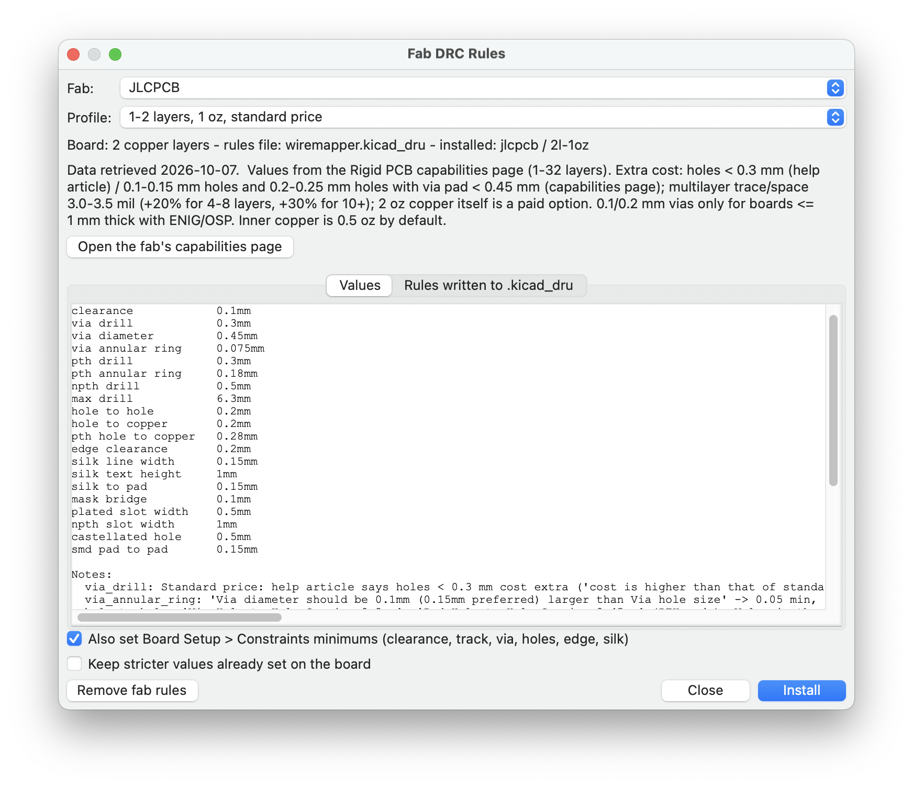

# Fab DRC Rules for KiCad

A PCB-editor toolbar button that installs the design rules (DRC) of the PCB fab
you are sending the board to. Pick the fab and a profile (layer count, copper
weight, standard or extra-cost options); the plugin writes the rules into the
project's `.kicad_dru` and, optionally, sets Board Setup > Constraints.

Tested with KiCad 10.0 (classic SWIG action plugin).

## Fabs included

AISLER, ALLPCB, Elecrow, Eurocircuits, JLCPCB, NextPCB, OSH Park, PCBCart,
PCBWay, Seeed Fusion. Each `fab_drc_rules/fabs/<fab>.json` holds the values in
mm, the source URLs, the date they were read and a note for every ambiguous
value. Fab capabilities change: check the fab's page (button in the dialog)
before ordering, and send corrections as pull requests to the JSON files.

## Install

| System  | Command |
|---------|---------|
| macOS   | `installers/install_macos.sh` |
| Linux   | `installers/install_linux.sh` (native and Flatpak KiCad) |
| Windows | `installers\install_windows.bat` |

Each takes a KiCad version (`9.0`, default `10.0`) and `--uninstall`
(`-Uninstall` on Windows). Then in the PCB editor: Tools > External Plugins >
Refresh Plugins, or restart KiCad.

## What it writes

* **`<board>.kicad_dru`** - a marked block (`# >>> fab_drc_rules: begin` ...
  `# <<< fab_drc_rules: end`) right after `(version 1)`. Installing another fab
  replaces only that block. Your own rules stay after it, so they take
  precedence. The first time, an existing rules file is backed up as
  `.kicad_dru.bak-<date>`. *Remove fab rules* takes the block out again.
* **Board Setup > Constraints** (optional) - minimum clearance, track width,
  via diameter, annular ring, through hole, hole clearance, hole to hole,
  copper to edge, silk text height/thickness. Save the board to keep them.

### Why copper clearance is not a custom rule

KiCad resolves custom rules as "last match wins", and custom rules come after
net classes. A plain `clearance` rule with the fab's minimum would replace
every net-class clearance (a 0.5 mm high-voltage class would drop to 0.1 mm).
The fab's clearance goes into Board Setup instead, which KiCad enforces as a
floor under the net classes.

## Rules generated

Track width (outer, inner), hole to hole, hole to copper, plated-pad hole to
copper, copper to edge, PTH hole and annular ring, NPTH hole, via drill /
diameter / annular ring, plated and non-plated slot width, castellated holes,
silkscreen text height/thickness, silkscreen to pad.

## License

GPL-3.0-or-later, like KiCad. See [LICENSE](LICENSE).

## Building the KiCad add-on package

`python3 tools/build_pcm.py` builds `dist/<identifier>_<version>.zip` from
`pcm/metadata.json`, plus the `metadata.json` (with download URL, SHA-256 and
sizes) and `icon.png` for the KiCad add-on metadata repository. The zip goes on
the GitHub release `v<version>`.
